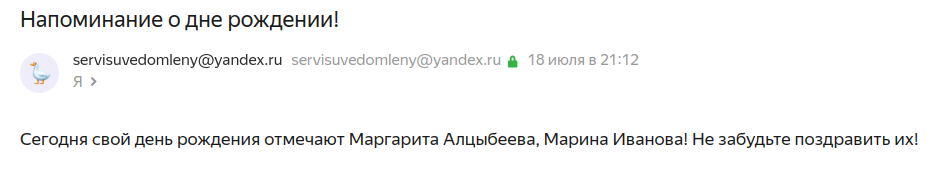

# Сервис поздравлений с днем рождения
### Как запустить
Чтобы запустить приложение нужно выполнить команду
```makefile
make run
```
Запустить миграции для базы данных командой
```makefile
make migrate-up
```
Чтобы остановить приложение нужно выполнить команду
```makefile
make stop
```
### Внешнее взаимодействие
Внешнее взаимодействие с сервисом возможно через Swagger UI. Доступен по пути:  
* *localhost:8080/api/swagger/*  

Для отправки запросов, которым нужна авторизация (всех, кроме регистрации и авторизации), необходимо скопировать полученный при регистрации или авторизации токен в поле ApiKeyAuth.

### Отправка уведомлений
Уведомления о дне рождении сотрудника для тех, кто на него подписался, и поздравления с днем рождения отправляются письмом на электронную почту сотрудника, которую он указал при регистрации.  
Уведомления отправляются раз в сутки.

### Система каталогов
* **build** - в этой директории находятся файлы для запускаемых образов в Docker
* **cmd** - main файлы для сервисов (точка входа)
* **docs** - сгенерированные файлы Swagger
* **internal** - внутренние файлы
* * **app** - запуск сервера
* * **middleware** - файлы мидлвар
* * **models** - модели
* * **pkg** - пакеты для логических сущностей
* * **utils** - пакет с дополнительными функциями
* **schema** - описание схемы базы данных
* *.env* - файл конфигурации приложения
